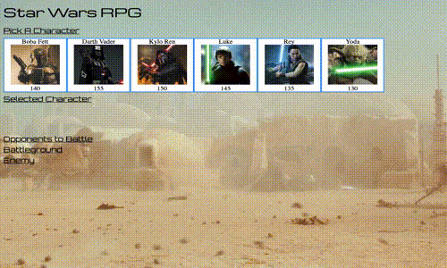
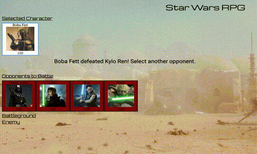

# 
 unit-4-game

#### Game Play

## Overview

This role playing game was created using jquery to dynamically update the HTML. The game is based on Star Wars using a selected player to defeat the rest of the characters. The key to winning the game is to select each opponent in the correct order. Audio was used from [soundboard]https://www.soundboard.com/sb/starwarsfx.

## How to Play

1. To start the game select the desired character by clicking on the image. The selected character will populate the selected character area and the others will poplulate the opponents area.
2. Select an opponent.
   - The selected opponent will move to the battlegound area and the others will hide.
3. To start a battle click the attack button.
   - You will attack your opponent first damaging them and then if they are still alive then they will get to counter attack damaging the selected character.
4. The battle will continue until either the users character or the opponent is defeated.
   - If the opponent is defeated they will be removed from the game board and the opponent selection and battle will start again until all of the opponents are defeated. And as a side note the users health will not regenerate but attack damage will increase.
   - If the users character is defeated the game is over and a reset button will appear to restart the game again.
